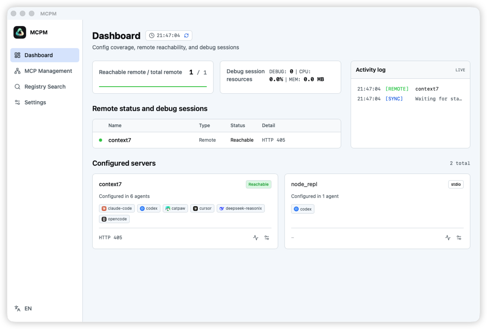
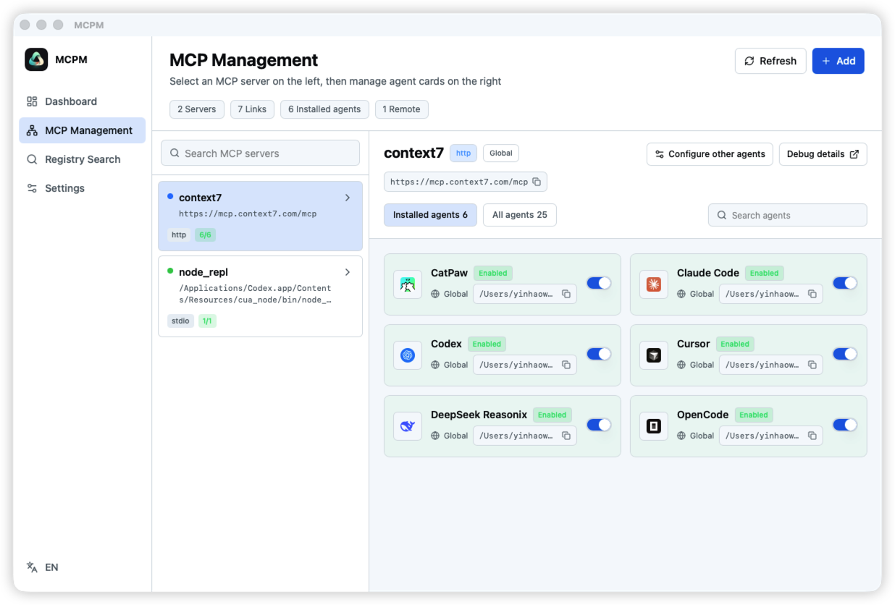
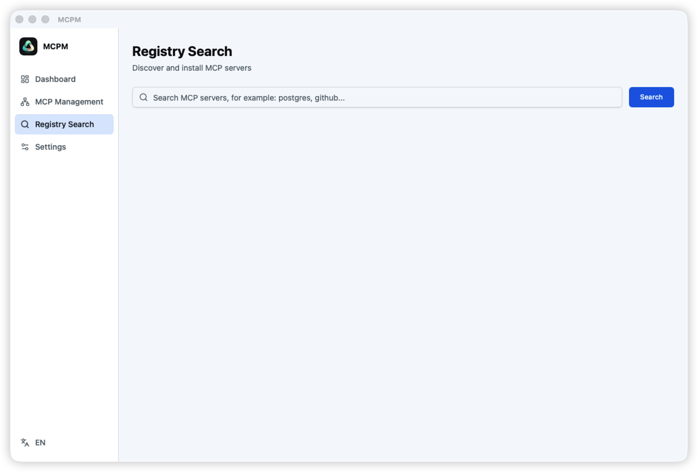
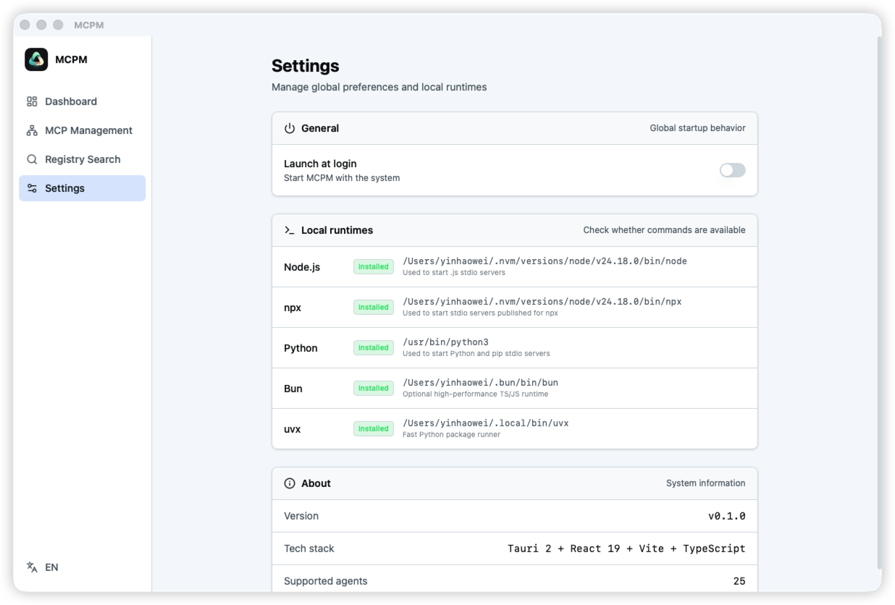

# MCPM

**A visual control center for MCP servers across AI coding agents.**

[简体中文](README.zh-CN.md) · [Architecture](docs/architecture.md) · [Supported agents](docs/supported-agents.md) · [Contributing](CONTRIBUTING.md)



MCP servers are powerful, but their configuration is scattered across editors, CLIs, desktop apps, global files, and project files. MCPM brings those configs into one desktop app, so you can install, compare, sync, and debug servers without remembering every agent's schema.

## Why MCPM

If you use more than one AI coding agent, MCP setup becomes a small configuration maze:

- Cursor, Claude Code, Codex, VS Code, Zed, Goose, Kiro, and OpenCode each expect a different config shape
- Some agents support remote HTTP servers, some support SSE, and some only support stdio
- Project-level config belongs in your repo, while global config belongs in your home directory
- The same server can appear under different names across agents
- Stdio servers are hard to debug once an agent starts them in the background

MCPM treats the MCP server as the source of truth. Pick a URL, npm package, command, or local executable once, then let the app write the native config for each target agent.

## What you can do

### Install once, target many agents

Add an MCP server from a remote URL, npm package, command, or path. Choose global or project scope, select one or more agents, and MCPM writes the right JSON, YAML, or TOML shape for each agent.

### See your MCP graph

Use the service-first view to see where each server is enabled. Use the agent-first view to inspect each agent's global and project configs. The dashboard shows remote reachability and active debug sessions.

### Find servers from registries

Search the add-mcp registry and the official MCP registry from the app. Registry metadata can prefill URLs, package identifiers, headers, environment variables, and runtime arguments.

### Debug stdio servers

Start a managed stdio debug session, stream stdout and stderr, watch CPU and memory usage, and send JSON-RPC messages from the detail page.

## Quick start

MCPM is in source-first development. Build it locally with pnpm, Rust, and the Tauri prerequisites for your operating system.

```bash
pnpm install
pnpm tauri dev
```

Build a desktop bundle:

```bash
pnpm tauri build
```

Run checks before contributing:

```bash
pnpm run typecheck
pnpm run build
cd src-tauri
cargo test
```

## Supported agents

MCPM currently supports 25 agent targets:

| Agent family | Examples |
| --- | --- |
| Mainstream coding agents | Claude Code, Codex, Cursor, Gemini CLI, GitHub Copilot CLI, VS Code |
| Desktop and editor clients | Claude Desktop, Cline, Goose, Kiro, OpenCode, Windsurf, Zed |
| China-focused agents | CodeWhale, DeepSeek Reasonix, Kimi Code, Qoder, TRAE CN, TRAE International, WorkBuddy |
| Additional targets | Antigravity, CatPaw, MCPorter, MiMoCode |

See [docs/supported-agents.md](docs/supported-agents.md) for config paths, project-scope support, transports, and optional fields.

## Built on add-mcp

MCPM is a desktop-oriented second development based on [neon-solutions/add-mcp](https://github.com/neon-solutions/add-mcp). The upstream project is the open MCP config tool for adding, finding, removing, and synchronizing MCP servers from the command line.

This project ports the core ideas into a Tauri desktop app:

- Source parsing for URLs, packages, commands, and paths
- Agent capability gates for transports and optional fields
- Native config transforms for each agent
- Registry search and install prefill
- Remove and sync by stable server identity

MCPM then adds a visual workflow, bilingual UI, runtime detection, process debugging, remote status checks, and tray behavior. The upstream `add-mcp` project is Apache-2.0 licensed, and its influence is documented here intentionally.

## Screenshots

| Dashboard | MCP Management |
| --- | --- |
|  |  |

| Registry Search | Settings |
| --- | --- |
|  |  |

## Documentation

- [Architecture](docs/architecture.md): source parsing, agent transforms, registry flow, and process debugging
- [Supported agents](docs/supported-agents.md): config paths, transports, project config, and optional fields
- [Release guide](docs/release.md): packaging, GitHub CLI commands, and release note workflow
- [Contributing](CONTRIBUTING.md): setup, checks, and pull request expectations
- [Security policy](SECURITY.md): how to report config-writing, command execution, and secret-handling issues
- [Changelog](CHANGELOG.md): release notes and upcoming changes

## Safety model

MCPM edits local agent config files and can start local stdio server commands during debugging. Review generated configs before committing project files, avoid storing secrets in shared config, and run only MCP servers you trust.

## Tech stack

MCPM uses Tauri 2, React 19, TypeScript, Zustand, Tailwind CSS, Rust, Tokio, and reqwest.

## License

MCPM is released under the [MIT License](LICENSE).
